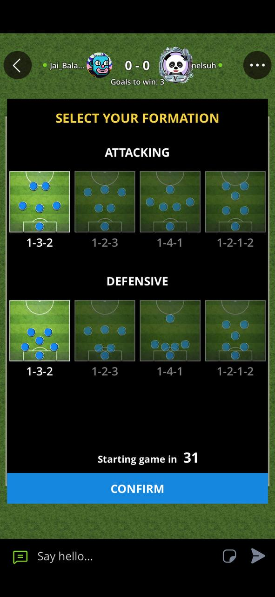
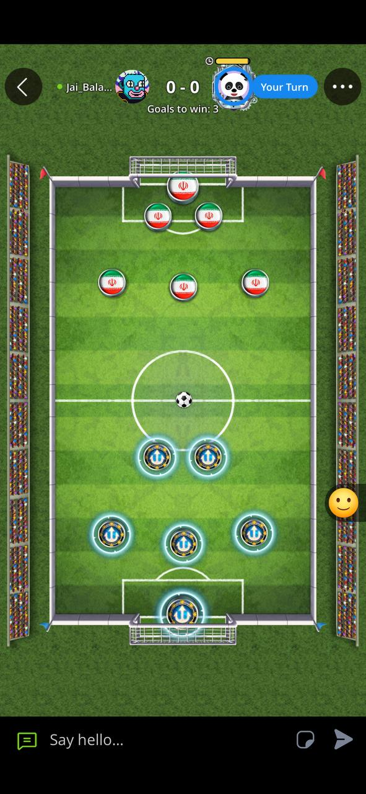
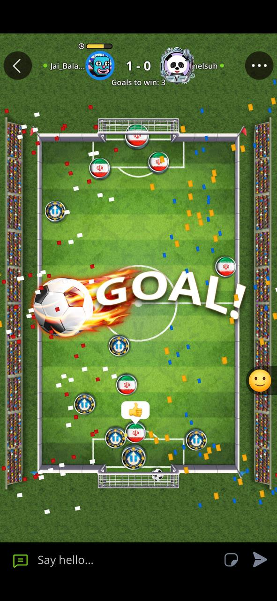

# Table Soccer (Ширээний хөл бөмбөг)

A 2-player turn-based table-soccer duel for the [Usion](https://usions.com)
platform, open-sourced as a **best-practice reference** for building real-time
*physics* games with the [Usion SDK](https://www.npmjs.com/package/@usions/sdk)
(`window.Usion`).

Three files, no build step: [index.html](index.html) · [script.js](script.js) · [style.css](style.css).

> Товч монголоор: энэ бол Usion платформ дээрх ширээний хөл бөмбөгийн бүрэн эх
> код. Детерминист физиктэй тоглоомд Usion SDK-ийн multiplayer гэрээг
> (authoritative-shooter загвар, per-sender snapshot versioning, checkpoint
> reconnect, forfeit grace, solo→host promotion, i18n) хэрхэн зөв
> хэрэгжүүлэхийг харуулах нээлттэй жишээ.

## Game rules (short)

- 2 players, 6 disks each + 1 ball. Drag one of your disks to shoot; turns
  alternate. First to **3 goals** wins.
- A goal counts only when ≥ 70% of the ball crosses the goal line; scoring on
  the **first shot of a round is a foul** (the other player restarts).
- Before each match both players pick an attacking and a defensive formation
  (1-3-2, 1-2-3, 1-4-1, 1-2-1-2) on a 10-second timer.
- In online matches, each player chooses one of the 48 FIFA World Cup 2026
  countries after confirming formations. Its flag becomes that player's disk
  skin and is carried through multiplayer actions and reconnect snapshots.

| | | |
|---|---|---|
|  |  |  |

## Why this is a reference implementation

### 1. Deterministic physics in fixed logical units

All physics runs at a fixed 60 Hz timestep on a fixed **400×600 logical
field** on every device — rendering and input scale between logical and
display space, so two phones with different screens simulate the identical
match. Shot velocities cross the wire **normalized by field size**, and both
clients animate the shot to the same resting state.

### 2. The authoritative-shooter model

Unlike a host-authoritative loop (one fixed authority), authority here follows
the action: the client who **took the shot** is the single authority for its
outcome. The receiver animates the same deterministic physics for a live view
but never runs its own goal/foul/turn logic — it freezes on the outcome and
waits for the shooter's settled `board_state` snapshot (score, turn, reset).
Float drift between machines can therefore never fork the match.

Snapshots are versioned with a **per-sender monotonic counter**
(`lastSnapshotVersionByPlayer`) — never a cross-device comparison, because two
devices' counters (or clocks) aren't ordered against each other; comparing
them silently drops valid moves.

### 3. The multiplayer contract, implemented

| Contract requirement | Where |
|---|---|
| `connect()` → register handlers → `join(config.roomId)` | `setupMultiplayer()` / `registerNetHandlers()` |
| Trust launch `mode`, never infer multiplayer from `roomId` | `launchedSolo()` |
| Solo → host promotion (host Share button) | `Usion.game.onRoomAssigned` → `onRoomPromoted()` |
| `playerIds[0]` = canonical roster; seats derived from it | `Usion.init` / `onJoined` |
| `action()` for durable moves, `realtime()` for ephemera | `shot`/`tactics`/`rematch` actions vs `board_state`/`player_info` |
| Winner decided by the authority, not self-reported | shooter-side `onGoalScored`; receiver freezes and waits |
| `onDisconnect` → real pause | `netPaused` freezes physics, bot and timers |
| `onPlayerLeft` → forfeit, with grace | 20 s `startForfeitGrace()`; any packet from the peer cancels it |

### 4. Reconnect recovery: durable checkpoint + live push

- Whoever **just settled a shot** persists the board with
  `Usion.game.setState()` (`writeCheckpoint()`). Actor-written — not
  host-only — so the checkpoint stays fresh even while the host is
  backgrounded.
- A (re)joining client receives it as `game_state` (join ack / `onSync`) and
  rebuilds the live match with `applyCheckpoint()`; it also asks peers for the
  live resting board (`request_state` → `board_state`) to catch a shot that
  settled while it was away.
- A snapshot that lands mid-animation is stashed (`pendingSnapshot`) and
  applied once local physics settles — the authoritative correction never
  yanks disks around visibly.

### 5. Replay-safe rematch (platform mode)

Platform mode has **no server-side restart event** —
`Usion.game.requestRematch()` is a pure broadcast. So the restart itself is a
durable stored action: `Usion.game.action("rematch", {reset: true})`, applied
on its sequenced echo by sender and receiver alike (`onAction`). Exactly-once,
and a reconnect can never lose the restart. If both players press Rematch
simultaneously, the **host** converts the double-request into the stored
action (deterministic tie-break).

### 6. Solo / GameTok

A `'single'` launch (Explore or the GameTok feed) drops straight into a
zero-tap match vs the bot — no menu. The same build still registers
`onRoomAssigned` up front, so the host's Share button can promote the solo
session into a live room mid-game (`onRoomPromoted()` tears the bot round
down and opens the waiting overlay).

### 7. Platform capabilities used

- `Usion.cloud` — cross-device win/loss stats (localStorage fallback), plus a
  shared `games_total` counter via atomic `shared.incr`.
- `Usion.leaderboard.submit` — cumulative wins.
- `Usion.saveResult` + `Usion.share` on the winner screen.
- i18n: every UI string lives in the `STR` table (mn/en), chosen via
  `Usion.getLanguage()` (navigator fallback outside the host). Theme via
  `Usion.getTheme()` — the pitch itself is art-directed green on every theme.
- No external CDNs: avatars fall back to inline SVG initials.

## Run it locally

```bash
npx @usions/devkit dev path/to/table_soccer     # or: usion dev .
# Player 1: http://localhost:4747/
# Player 2: http://localhost:4747/?player=2
```

The devkit fake host serves the game with real platform semantics (rooms,
sequenced actions, checkpoints) and a chaos panel — blip the connection and
watch the pause/resync, or drop a player and watch the 20 s forfeit grace.
Test under bad networks with
`Usion.game.simulateNetwork({ latencyMs: 150, jitterMs: 60, lossPct: 5 })`.

Note: the platform injects `https://usions.com/usion-sdk.js`; the script tag in
`index.html` exists so the game also runs self-hosted/standalone.

## License

[MIT](LICENSE)

Country flag SVGs in `assets/flags/` come from
[flag-icons](https://github.com/lipis/flag-icons) 7.5.0 and retain its included
MIT license (`assets/flags/LICENSE.flag-icons`).
